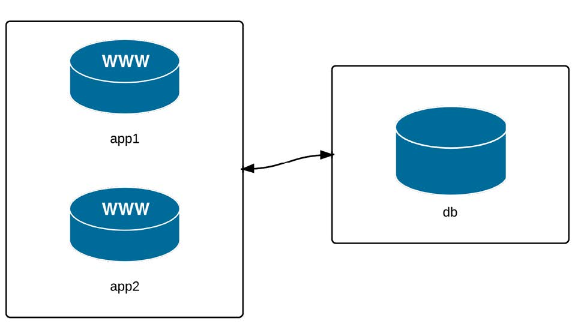

Développer l'infrastructure locale avec Vagrant
===
### Introduction

La dernière décennie a vu la croissance de nombreux outils de virtualisation qui
permettent une émulation d'infrastructure flexible et très puissante, le tout
depuis votre poste de travail local !

Vagrant, un outil d'approvisionnement de serveur, et VirtualBox, un environnement
de virtualisation local, forment une puissante combinaison pour tester
l'infrastructure et les configurations de serveur individuelles localement.
Les deux applications sont gratuites et open source, et fonctionnent bien sur
les hôtes Mac, Linux ou Windows.

## Votre premier serveur local : Configurer Vagrant

Pour commencer avec votre premier serveur virtuel local, vous devez télécharger
et installer Vagrant et VirtualBox, et configurer un simple **Vagrantfile**, qui
décrira le serveur virtuel.

1. Téléchargez et installez Vagrant et VirtualBox (selon la version appropriée
  pour votre système d'exploitation) : - Téléchargez Vagrant - Téléchargez
  VirtualBox (lors de l'installation, assurez-vous que les outils de ligne de
  commande sont installés)
2. Créez un nouveau dossier quelque part sur votre disque dur où vous conserverez
votre fichier **Vagrantfile** et les instructions d'approvisionnement.
3. Ouvrez une fenêtre Terminal ou PowerShell, puis accédez au dossier que vous
venez de créer
4. Ajoutez une « boîte » CentOS 7.x 64 bits à l'aide de la commande
 `vagrant box add` : `vagrant box add centos/7` (remarque : Vagrant cloud a une
  liste complète de différentes boîtes Linux préfabriquées. Consultez également
  les boîtes 'officielles' de Vagrant Ubuntu dans la documentation de Vagrant's
  Boxes.
5. Créez une configuration de serveur virtuel par défaut en utilisant la boîte
 que vous venez de télécharger : `vagrant init centos/7`
6. Démarrez votre serveur CentOS : `vagrant up`

Vagrant va télécharger une machine virtuelle CentOS 7 64 bits pré-construite
(vous pouvez créer vos propres "boîtes" de machines virtuelles),
la charger dans VirtualBox avec la configuration définie dans le fichier
**Vagrantfile** par défaut (qui est maintenant dans le dossier que vous avez créé
précédemment) et va démarrer la machine virtuelle.

La gestion de ce serveur virtuel est extrêmement simple :
`vagrant halt` arrêtera la machine virtuelle,
`vagrant up` la fera redémarrer
et `vagrant destroy` supprimera complètement la machine de VirtualBox.
Un simple  `vagrant up` à nouveau le recréera à partir de la boîte de base que
 vous avez téléchargée à l'origine.
Maintenant que vous avez un serveur en cours d'exécution, vous pouvez l'utiliser
comme n'importe quel autre serveur, et vous pouvez vous connecter via SSH.
Pour vous connecter, entrez `vagrant ssh` à partir du dossier où se trouve le
fichier Vagrant. Si vous souhaitez vous connecter manuellement ou à partir d'une
autre application, entrez `vagrant ssh-config` pour obtenir les détails SSH requis.

## Construire une infrastructure des test avec Vagrant

Nous avons utilisé Vagrant pour démarrer une machine virtuelle exécutant CentOS 7.
Dans cet exemple, nous avons utilisé toute la configuration par défaut de Vagrant
définie dans le fichier Vagrant.
Dans l'exemple suivant, nous utiliserons les puissantes fonctionnalités de
gestion multi-machines de Vagrant:



Nous allons gérer trois VMs : deux serveurs d'applications et un serveur de base
de données.

Pour commencer, créez un nouveau dossier quelque part sur votre disque local
(j'aime utiliser ∼/VMs/[dir]), et créez un nouveau fichier nommé **Vagrantfile**
(c'est ainsi que nous décrivons nos machines virtuelles à Vagrant).
Ouvrez le fichier dans votre éditeur préféré, ajoutez les éléments suivants
et enregistrez le fichier :

``` ruby
#  -*-  mode:  ruby -*-
# vi: set ft=ruby  :

VAGRANTFILE_API_VERSION = "2"
Vagrant.configure(VAGRANTFILE_API_VERSION)  do  |config|
  # General Vagrant VM   configuration.
  config.vm.box  =  "centos/7"
  config.ssh.insert_key  =  false
  config.vm.synced_folder  ".",  "/vagrant",  disabled:  true
  config.vm.provider  :virtualbox  do  |v|
  	v.memory  =  1024
  	v.linked_clone  =  true
	end

  #  ControlMaster
  config.vm.define  "master"  do  |app|
    app.vm.hostname  =  "master.dev"
    app.vm.network  :private_network,  ip:  "192.168.60.1"
  end

	#  Application  server 1.
	config.vm.define  "app1"  do  |app|
  	app.vm.hostname  =  "app1.dev"
  	app.vm.network  :private_network,  ip:  "192.168.60.4"
	end

	#  Application  server 2.
	config.vm.define  "app2"  do  |app|
  	app.vm.hostname  =  "app2.dev"
  	app.vm.network  :private_network,  ip:  "192.168.60.5"
	end

	#  Database  server.
	config.vm.define  "db"  do  |db|
  	db.vm.hostname  =  "db.dev"
  	db.vm.network  :private_network,  ip:  "192.168.60.6"
	end
end
```
Ce **Vagrantfile** définit les trois serveurs que nous voulons gérer et attribue à
chacun un nom d'hôte, un nom de machine (pour VirtualBox) et une adresse IP uniques.
Par souci de simplicité, les trois serveurs exécuteront CentOS 7.
Ouvrez une fenêtre de terminal et changez de répertoire dans le même dossier où
le fichier **Vagrantfile** que vous venez de créer existe. Entrez `vagrant up` pour
laisser Vagrant commencer à construire les trois machines virtuelles.

Pour accéder à la machine master, exécutez `vagrant ssh master`. Vagrant vous
connecte sur le terminal de la machine _master_ en utilisant SSH et sans besoin
de saisir le mot de passe de l'utilisateur _vagrant_.

Testez l'accès aux autres VMs.
